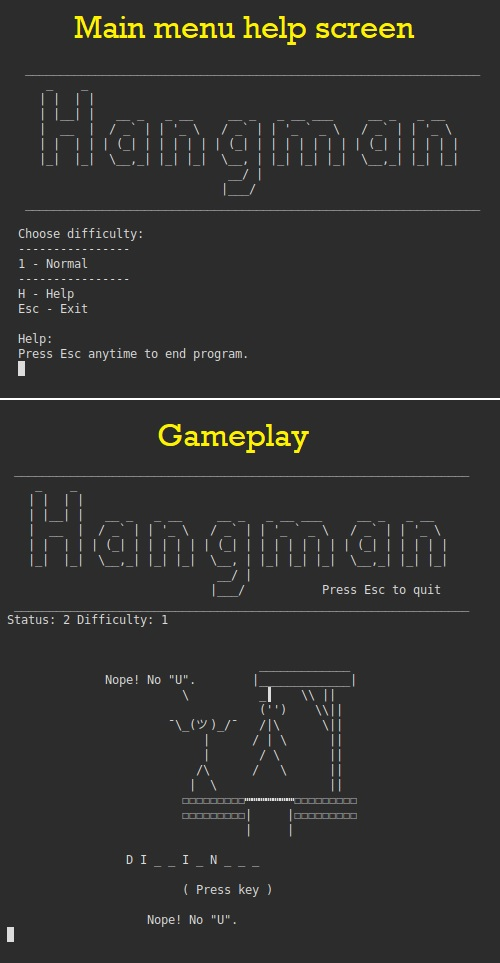

# Hangman
Classic Hangman game made as a practice project for [Tero Karvinen's Go Programming course](http://terokarvinen.com/2020/go-programming-course-2020-w22/)

[Binary downloads (Windows, Mac, Linux)](bin/)  

~~~~
Tested on:
- Linux (Works)
  - Can open help page
  - Can start the game
  - Can win and lose the game
  - Can restart and escape to menu
  - Minor bug: Arrow keys function as Esc
- Mac (Borked)
  - Menu opens
  - Fatal bug: Number input doesn't function, can't start game.
- Windows (Borked)
  - Menu opens
  - Can open help page with H-key
  - Fatal bug: Number input doesn't work, can't start game.
  - Bug: Esc input doesn't work
~~~~

~~~~
Beta
TODO:
 - Wordlist
 - Difficulty options
~~~~

Learning materials:
[SOURCES.md](SOURCES.md)
