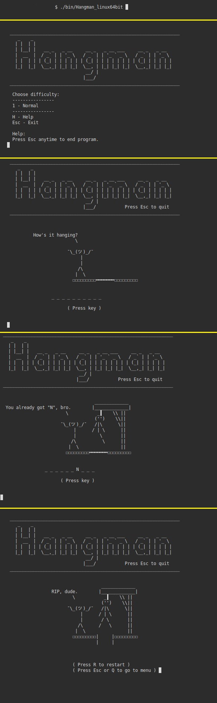

# Hangman
Classic Hangman game made as a practice project for [Tero Karvinen's Go Programming course](http://terokarvinen.com/2020/go-programming-course-2020-w22/)

~~~~
Alpha version
- Asks user to input letters
- Reveals letters that have been guessed correctly 
- Does not yet have fail a state
- Hangman himself is not present
~~~~

Materials used:  
http://www.desiquintans.com/nounlist  `nounlist not implemented`  
https://stackoverflow.com/questions/14094190/function-similar-to-getchar#answer-17278730  
https://stackoverflow.com/questions/11268943/is-it-possible-to-capture-a-ctrlc-signal-and-run-a-cleanup-function-in-a-defe  
https://gobyexample.com/signals  
https://gobyexample.com/exit  
